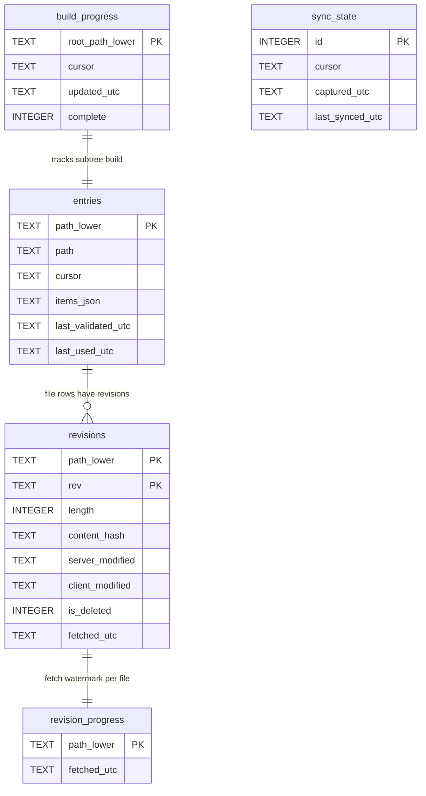

# IntelliTect.Dropbox.Core

Standalone, PowerShell-free core for working with the Dropbox API v2.

- Comprehensive `DropboxServiceClient` wrapper over `Dropbox.Api`.
- Builds a `DropboxClient` directly from an app key/secret/refresh token (or access token).
- Metadata cache, rate-limit retry, credential persistence, and a framework-neutral
  wildcard matcher.

Multi-targets `netstandard2.0` and `net8.0`. Independent of `IntelliTect.Dropbox.Auth`.

## Metadata cache

Each cache entry holds the items from a prior non-recursive `list_folder` for a
path, together with the cursor describing that snapshot. Reads call
`list_folder/continue(cursor)` to apply deltas, so Dropbox always remains the
master.

`MetadataCache.BuildAsync(path)` pre-populates an entire subtree with a
recursive `list_folder` read **page by page**. Each page is grouped by parent
folder, stored as per-folder entries, and flushed to disk together with an
in-progress cursor before the next page is fetched. An interrupted build resumes
from the last persisted cursor on the next call; if Dropbox reports the cursor
is stale, the build restarts from the first page. The recursive listing also
requests media info and explicit-shared-member flags (returned at no extra
request cost), so built entries are enriched as a side effect.

Because a recursive listing yields only one subtree cursor (not per-folder
cursors), the built entries start with an empty cursor. An entry with an empty
cursor acquires a real per-folder cursor on its first validated read
(`GetChildrenAsync`/`UpdateAsync`) via a fresh `list_folder`, after which it
validates like any other entry. A built entry is therefore never served without
first reconciling against Dropbox.

`MetadataCache.BuildRevisionsAsync(path)` runs a separate, resumable pass that
fetches each file's revision history (`list_revisions`) and stores it. Files
whose revisions were fetched within the staleness window (24 hours by default)
are skipped, so repeating the pass is cheap.

### Incremental refresh (account-wide delta cursor)

A full build of a large account is expensive, so the cache supports an
incremental refresh that brings it up to date without re-walking everything.
`MetadataCache.EnsureSyncCursorAsync()` captures a single account-wide recursive
delta cursor **at build start** (via `list_folder/get_latest_cursor`, which
returns in constant time and never enumerates entries, so it cannot wedge on a
huge account). It is capture-if-absent, so resuming an interrupted build keeps
the original anchor.

`MetadataCache.SyncAsync()` later drains `list_folder/continue` from that cursor,
applying each page's adds/updates/removes to the matching parent-folder entries
and advancing plus persisting the cursor after every page (so an interrupted
drain resumes from the last completed page). If Dropbox rejects the cursor, the
result's `ResetRequired` flag signals that a full rebuild is needed.
`ResetSyncCursorAsync()` discards the cursor and captures a fresh one for a
rebuild. The whole flow is exposed through the single `Build-DropboxCache`
cmdlet: a normal build captures the cursor, `-Refresh` drains deltas, and
`-Rebuild` wipes the cache and recaptures.

### Persistence schema

- `build_progress` records the resumable subtree cursor and a completion flag.
- `revisions` holds one row per file revision, keyed by path and rev.
- `revision_progress` is the per-file fetch watermark used for staleness skips.
- `sync_state` is a single row holding the account-wide delta cursor used by the
  incremental refresh, with its capture and last-drained timestamps.
