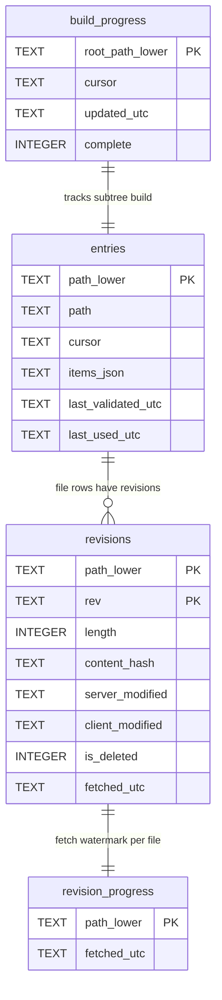

# IntelliTect.Dropbox.Core

Standalone, PowerShell-free core for working with the Dropbox API v2.

- Comprehensive `DropboxServiceClient` wrapper over `Dropbox.Api`.
- Builds a `DropboxClient` directly from an app key/secret/refresh token (or access token).
- Metadata cache, rate-limit retry, credential persistence, and a framework-neutral
  wildcard matcher.

Multi-targets `netstandard2.0` and `net10.0`. Independent of `IntelliTect.Dropbox.Auth`.

## Metadata cache

Each cache entry holds the items from a prior non-recursive `list_folder` for a
path, together with the cursor describing that snapshot. Reads call
`list_folder/continue(cursor)` to apply deltas, so Dropbox always remains the
master.

`MetadataCache.BuildAsync(path)` pre-populates an entire subtree with a
recursive `list_folder` read **page by page**. Each page is grouped by parent
folder, stored as per-folder entries, and flushed to disk together with an
in-progress cursor before the next page is fetched. An interrupted build resumes
from the last persisted cursor on the next call; if Dropbox reports the cursor
is stale, the build restarts from the first page. The recursive listing also
requests media info and explicit-shared-member flags (returned at no extra
request cost), so built entries are enriched as a side effect.

Because a recursive listing yields only one subtree cursor (not per-folder
cursors), the built entries start with an empty cursor. An entry with an empty
cursor acquires a real per-folder cursor on its first validated read
(`GetChildrenAsync`/`UpdateAsync`) via a fresh `list_folder`, after which it
validates like any other entry. A built entry is therefore never served without
first reconciling against Dropbox.

`MetadataCache.BuildRevisionsAsync(path)` runs a separate, resumable pass that
fetches each file's revision history (`list_revisions`) and stores it. Files
whose revisions were fetched within the staleness window (24 hours by default)
are skipped, so repeating the pass is cheap.

### Persistence schema

- `build_progress` records the resumable subtree cursor and a completion flag.
- `revisions` holds one row per file revision, keyed by path and rev.
- `revision_progress` is the per-file fetch watermark used for staleness skips.
